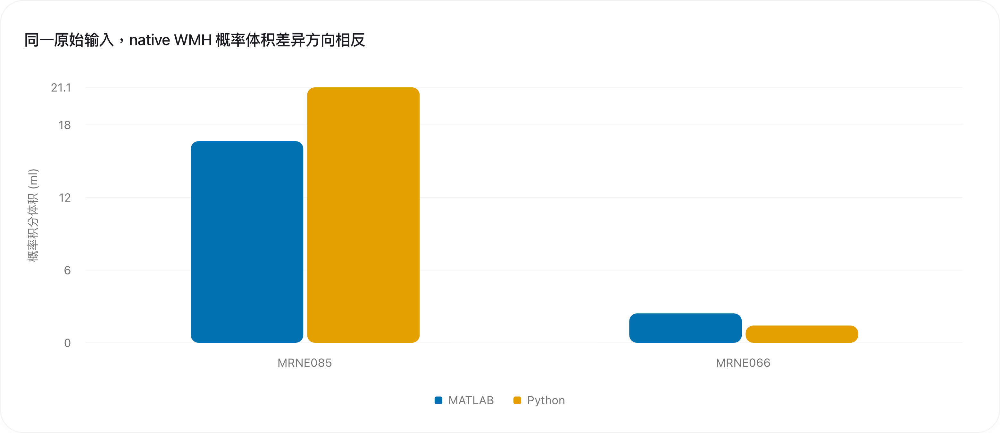
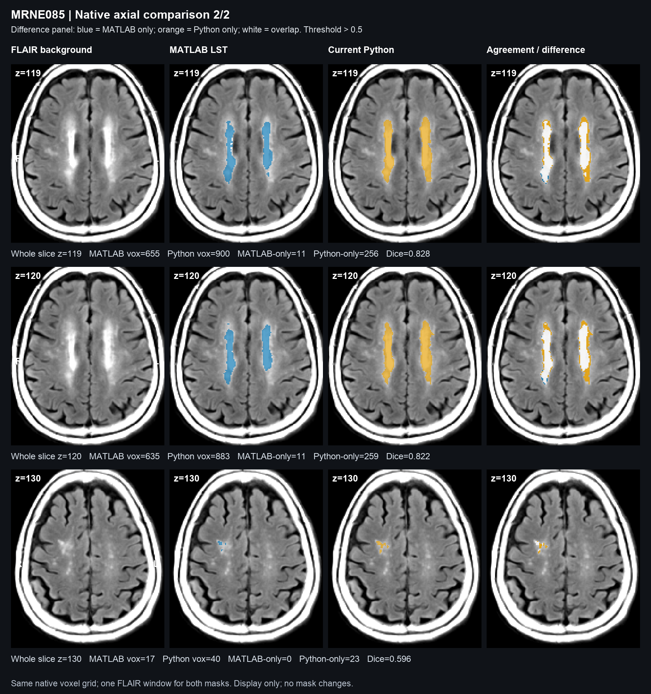
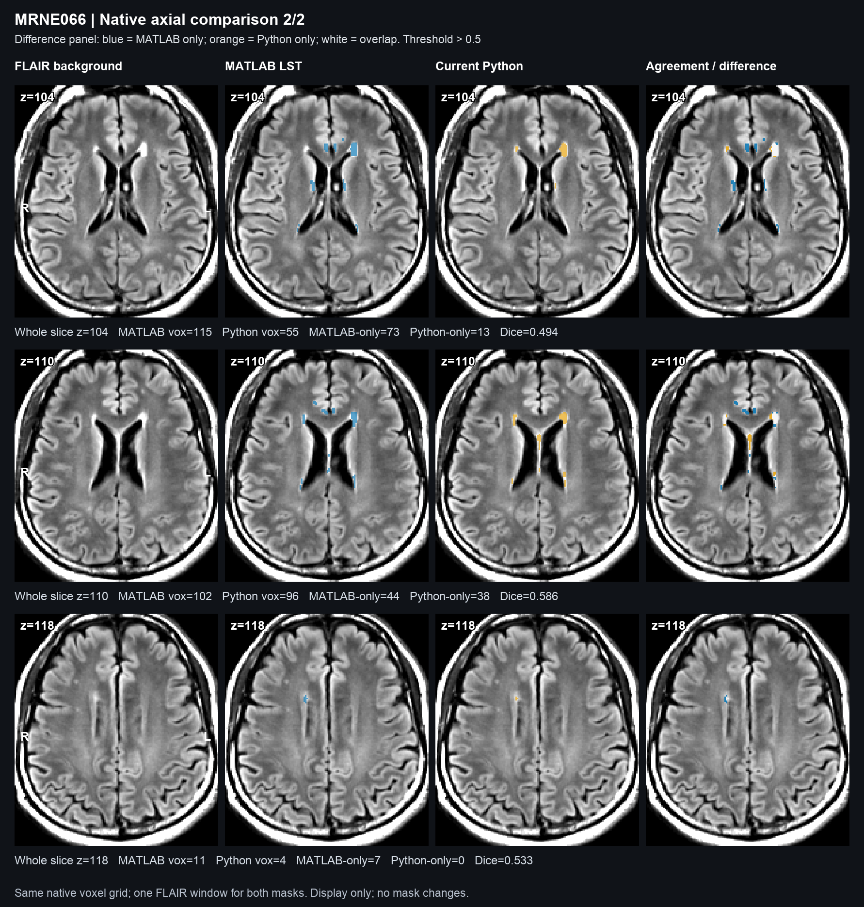

# WMH-Age-Prediction

Automated White Matter Hyperintensity (WMH) segmentation and WMH-based Brain Age Estimation pipeline for T1-weighted and 3D T2-FLAIR brain MRI scans.

This repository provides two pipelines:
1. **`pywmh_tool`**: A standalone Python/FSL pipeline with a native-space port of the **LST Lesion Growth Algorithm (LGA)** and spatial priors (`atlas_wm` & `noles`). The growth core can be validated with identical LST inputs; FSL preprocessing does not reproduce SPM tissue maps or FLAIR bias correction automatically. Production segmentation does not require MATLAB or SPM.
2. **`AutomatedWMHAge.m` / `run_wmh_age.sh`**: The optimized legacy MATLAB pipeline using SPM12 and the LST toolbox, enhanced for headless command-line batch processing without GUI popups.

---

## Background & Methodology

The brain age prediction model is based on the publication:
> **Chu-Chung Huang, et al. (2022)**. *Brain white matter hyperintensities-predicted age reflects neurovascular health in middle-to-old aged subjects*. **Age and Ageing**, 51(8), afac106. [https://doi.org/10.1093/ageing/afac106](https://doi.org/10.1093/ageing/afac106)

The model computes volumes for:
- **PVWMH** (Periventricular White Matter Hyperintensity, ≤ 10 mm from ventricular lining)
- **DWMH** (Deep White Matter Hyperintensity, > 10 mm from ventricular lining)

The predicted WMH Brain Age is estimated via:

$$
\text{Predicted Age} = 11.069 \cdot \log_{10}(\max(V_{\text{PV}}, 10^{-4})) + 1.624 \cdot \log_{10}(\max(V_{\text{D}}, 10^{-4})) + 64.159
$$

---

## 1. Pure Python Standalone Pipeline (`pywmh_tool.py`)

### Algorithmic Framework: Native Python LST-LGA
`pywmh` is built directly upon the algorithmic principles of the **Lesion Growth Algorithm (LGA)** from the [LST toolbox](https://www.applied-statistics.de/lst.html) (Schmidt et al., 2012):
1. **Tissue Probability Mapping**: FSL FAST estimates Partial Volume Estimation (PVE) maps for CSF, Grey Matter, and White Matter.
2. **FLAIR Normalization**: Original LST unit-width histogram mode, including tied modes.
3. **Lesion Belief Calculation**: Initial lesion belief maps ($B_{\text{gm}}, B_{\text{wm}}, B_{\text{csf}}$) combine tissue probabilities, contrast differences, and spatial priors.
4. **Spatial Priors**: Uses the official LST white matter prior (`atlas_wm.nii.gz`) and exclusion mask (`noles.nii.gz`) in native space to restrict lesion belief maps.
5. **Iterative MRF Region Growing**: Uses a Markov Random Field (MRF) model with Gamma-distributed lesion likelihood and normal tissue Gaussian mixture models to iteratively grow lesions from seeds until convergence.
6. **Original Label and Growth Rules**: T1-dependent PVE labels, FLAIR-bright CSF core relabeling, two-color sequential MRF updates and the original frontier stopping rule. No subject-specific corrections or fitted volume multipliers are used.

The segmentation function now requires bias-corrected T1 intensities alongside tissue maps, or a precomputed `p0` label. FAST is run with `-B` to provide its corrected T1. Legacy lesion caches are recomputed unless their algorithm version, parameters and input hashes match. Probability outputs are explicitly float32.

For identical-input native-space validation, install `requirements-validation.txt` and run:

```bash
python docs/validate_native_lga.py \
  --cache /path/to/LST_lga_rmFLAIR.mat \
  --reference /path/to/ples_lga_0.3_rmFLAIR.nii \
  --output /tmp/native_lga_validation.json
```

The adapter reads reference lesions only after segmentation for comparison. It is not imported by the production algorithm. Matching this core does not establish equivalence of the complete FAST/FSL and SPM preprocessing pipelines. See `docs/native_lga_validation.md` for the validation scope and results.

### The Role of $\kappa$ (Kappa)
**Does the algorithm require $\kappa$? Yes.**
As in the original LST-LGA implementation, $\kappa$ (kappa) is the user-definable **initial belief threshold** that governs seed initialization:
- **Default value**: `kappa = 0.3` (the recommended baseline by the LST developers for standard 3T FLAIR scans).
- **Lower $\kappa$ (e.g., `0.1` – `0.2`)**: More liberal; initializes more seeds, capturing subtle or faint punctate hyperintensities.
- **Higher $\kappa$ (e.g., `0.4` – `0.5`)**: More conservative; seeds are placed only on prominent, confluent hyperintensities.

### Requirements
- Python 3.8+
- [FSL](https://fsl.fmrib.ox.ac.uk/fsl/fslwiki) (FLIRT, BET, FAST, APPLYWARP)
- Python packages:
  ```bash
  pip install -r requirements.txt
  ```

### Usage
```bash
python pywmh_tool.py \
  --t1 /path/to/T1w.nii.gz \
  --flair /path/to/FLAIR.nii.gz \
  --age 65.0 \
  --outdir /path/to/output_directory \
  --kappa 0.3
```

#### Arguments:
- `--t1`: Path to T1-weighted structural MRI scan (`.nii` or `.nii.gz`).
- `--flair`: Path to a FLAIR MRI scan (`.nii` or `.nii.gz`).
- `--age`: (Optional) Patient's actual chronological age in years. Automatically computes **Brain Age Gap (BAG)**.
- `--outdir`: Directory to save outputs.
- `--kappa`: Initial lesion belief threshold (default: `0.3`, standard LST-LGA setting).
- `--skip-qc`: (Optional) Skip generating visual QC HTML/PNG reports.
- `--force`: (Optional) Force re-running all steps even if intermediate files exist.
- `--nonlinear`: Use FSL FNIRT for non-linear registration to MNI (default: 12-DOF affine FLIRT for speed).
- Configure the FSL installation through `$FSLDIR` and ensure its commands are on `$PATH`.

### Outputs
- `WMH_Age_QC_Report.html`: Self-contained, interactive HTML report with embedded high-resolution graphics, metrics tables, and registration sanity checks.
- `qc_summary.png`: Multi-slice thumbnail snapshot for rapid Finder / Explorer review.
- `WMH_Age_Results.csv`: Extended summary table with Total WMH, PVWMH, DWMH, TIV, % TIV, Predicted Age, Brain Age Gap, Lobar WMH (Frontal, Parietal, Temporal, Occipital, Subcortical), and Arterial Vascular WMH (ACA, MCA, PCA, VB).
- `WMH_Age_Results.json`: Comprehensive machine-readable quantification results.
- `bles_lga_k30.nii.gz`: Native-space binary WMH lesion mask.
- `ples_lga_k30.nii.gz`: Native-space lesion probability map.
- `native_PVWMH.nii.gz`: Native-space periventricular mask.
- `native_DWMH.nii.gz`: Native-space deep white matter mask.
- `native_lobar.nii.gz`: Native-space cerebral lobar parcellation.
- `native_arterial.nii.gz`: Native-space arterial vascular territory parcellation.
- `rmFLAIR.nii.gz`: Rigidly co-registered FLAIR aligned to T1.

---

## 2. Headless MATLAB Pipeline (`run_wmh_age.sh`)

If you require exact legacy SPM12/LST execution without launching the MATLAB GUI:

```bash
./run_wmh_age.sh \
  /Applications/MATLAB_R2022a.app/bin/matlab \
  /path/to/subjects_folder \
  /path/to/WMH_Atlas \
  /path/to/spm12
```

*(Note: The MATLAB version is also archived on the `matlab-version` branch of this repository).*

---

## Segmentation Validation & Visual Comparison

### Actual native-space comparison (2026-10-09)

The current Python pipeline was tested on the existing MRNE085 and MRNE066 examples, with **its own FAST tissue maps and native FLAIR inputs**. MATLAB references are the existing original LST native outputs. Python does not consume MATLAB tissue labels or reference lesions during segmentation. Registration was neither rerun nor evaluated.

| Case | MATLAB probability volume (ml) | Python probability volume (ml) | Relative difference | Binary Dice |
|---|---:|---:|---:|---:|
| MRNE085 | 16.656 | 21.101 | +26.7% | 0.812 |
| MRNE066 | 2.424 | 1.420 | -41.4% | 0.559 |

Probability volumes sum the continuous maps; binary comparisons use a strict threshold of **> 0.5**. These two cases show that the default FAST/FSL pipeline is not yet equivalent to the complete MATLAB pipeline.



**MRI examples:** left to right, common FLAIR background, MATLAB mask, current Python mask, and disagreement overlay. In the disagreement column, blue is MATLAB-only, orange is Python-only, and white is overlap. Slice selection is automatic and recorded in the report.





[Eight-page illustrated test report](reports/2026-10-09_native_comparison/WMH_native_comparison_2026-10-09.pdf) · [Full-precision metrics](reports/2026-10-09_native_comparison/data/metrics.csv) · [All slice metrics](reports/2026-10-09_native_comparison/data/per_slice_metrics.csv) · [Methods and reproduction](reports/2026-10-09_native_comparison/README.md)

### Numerical validation of the LGA core

With identical upstream LST inputs, the port reproduces both example probability maps exactly (Dice 1.0). Three independent synthetic cases also match the original MATLAB labels and float32 probability outputs. This validates the native growth equations; it is a separate experiment from the independent FAST/FSL results above. See [the validation details](docs/native_lga_validation.md).

```bash
python3 -m unittest discover -s tests -v
```

---

## Repository Structure
```
WMH-Age-Prediction/
├── pywmh/                  # Python core algorithmic library
│   ├── __init__.py
│   ├── lst_lga.py          # Native LST labels, beliefs and growth equations
│   ├── fsl_engine.py       # FSL wrapper (FLIRT, BET, FAST, APPLYWARP)
│   └── age_model.py        # WMH masking and age regression model
├── pywmh_tool.py           # CLI master entry point for Python pipeline
├── wmh_age_calc.py         # Standalone age calculator given existing masks
├── AutomatedWMHAge.m       # Optimized MATLAB pipeline (SPM12/LST)
├── run_wmh_age.sh          # Headless shell script for MATLAB execution
├── WMH_Atlas/              # 1mm and 1.5mm PV/D WMH atlases, atlas_wm & noles
├── requirements.txt        # Python package dependencies
├── LICENSE                 # GNU GPL v3
└── README.md               # Documentation
```

---

## Acknowledgements & Software Attributions

This project builds upon and integrates foundational tools developed by the neuroimaging community:

- **[LST (Lesion Segmentation Tool)](https://www.applied-statistics.de/lst.html)**: Developed by Paul Schmidt, Christian Gaser, and colleagues at the Technische Universität München. The Python native LGA equations are ported from the original LST implementation; complete pipeline equivalence also requires equivalent upstream inputs.
- **[FSL (FMRIB Software Library)](https://fsl.fmrib.ox.ac.uk/fsl/fslwiki)**: Developed by the Analysis Group, FMRIB, University of Oxford. Used in this pipeline for robust structural brain extraction (`bet`), rigid cross-modal co-registration (`flirt`), automated tissue segmentation (`fast`), and the MNI Structural Atlas.
- **[Digital 3D Brain MRI Arterial Territories Atlas](https://github.com/Chin-Fu-Liu/Arterial_Atlas)**: Developed by Chin-Fu Liu, Andreia Faria, and colleagues at Johns Hopkins University School of Medicine. Used for hierarchical parcellation of major arterial vascular territories (ACA, MCA, PCA, VB).
- **[SPM (Statistical Parametric Mapping)](https://www.fil.ion.ucl.ac.uk/spm/)**: Developed by the Wellcome Centre for Human Neuroimaging, University College London (UCL). Hosts the reference MATLAB implementation of the LST toolbox.

---

## Citation

Please cite the corresponding papers depending on which components you use in your study:

### 1. For White Matter Hyperintensity (WMH) Lesion Segmentation (LST-LGA):
> **Schmidt P**, et al. *An automated tool for detection of FLAIR-hyperintense white-matter lesions in Multiple Sclerosis*. **NeuroImage**. 2012;59(4):3774-3788.  
> DOI: [10.1016/j.neuroimage.2011.11.032](https://doi.org/10.1016/j.neuroimage.2011.11.032)

```bibtex
@article{schmidt2012automated,
  title={An automated tool for detection of FLAIR-hyperintense white-matter lesions in Multiple Sclerosis},
  author={Schmidt, Paul and others},
  journal={NeuroImage},
  volume={59},
  number={4},
  pages={3774--3788},
  year={2012},
  publisher={Elsevier},
  doi={10.1016/j.neuroimage.2011.11.032}
}
```

### 2. For WMH-based Brain Age Prediction & Regional WMH Volume Calculation (PVWMH / DWMH):
> **Huang CC**, et al. *Brain white matter hyperintensities-predicted age reflects neurovascular health in middle-to-old aged subjects*. **Age and Ageing**. 2022;51(8):afac106.  
> DOI: [10.1093/ageing/afac106](https://doi.org/10.1093/ageing/afac106)

```bibtex
@article{huang2022brain,
  title={Brain white matter hyperintensities-predicted age reflects neurovascular health in middle-to-old aged subjects},
  author={Huang, Chu-Chung and others},
  journal={Age and Ageing},
  volume={51},
  number={8},
  pages={afac106},
  year={2022},
  publisher={Oxford University Press},
  doi={10.1093/ageing/afac106}
}
```

### 3. For Arterial Vascular Territory Parcellation:
> **Liu CF**, Hsu J, Xu X, Kim G, Sheppard SM, Meier EL, Miller MI, Hillis AE, Faria AV. *Digital 3D Brain MRI Arterial Territories Atlas*. **Scientific Data**. 2023;10(1):74.  
> DOI: [10.1038/s41597-022-01923-0](https://doi.org/10.1038/s41597-022-01923-0)

```bibtex
@article{liu2023digital,
  title={Digital 3D Brain MRI Arterial Territories Atlas},
  author={Liu, Chin-Fu and Hsu, Jui-Yang and Xu, Xiaoying and Kim, Gina and Sheppard, Shannon M and Meier, Elizabeth L and Miller, Michael I and Hillis, Argye E and Faria, Andreia V},
  journal={Scientific Data},
  volume={10},
  number={1},
  pages={74},
  year={2023},
  publisher={Nature Publishing Group UK London},
  doi={10.1038/s41597-022-01923-0}
}
```

### 4. For Cerebral Lobar Parcellation (MNI Structural Atlas):
> **Mazziotta J**, et al. *A probabilistic atlas and reference system for the human brain: International Consortium for Brain Mapping (ICBM)*. **Philosophical Transactions of the Royal Society of London. Series B: Biological Sciences**. 2001;356(1412):1293-1322.  
> DOI: [10.1098/rstb.2001.0915](https://doi.org/10.1098/rstb.2001.0915)  
> **Collins DL**, Holmes CJ, Peters TM, Evans AC. *Automatic 3-D model-based neuroanatomical segmentation*. **Human Brain Mapping**. 1995;3(3):190-208.  
> DOI: [10.1002/hbm.460030304](https://doi.org/10.1002/hbm.460030304)

```bibtex
@article{mazziotta2001probabilistic,
  title={A probabilistic atlas and reference system for the human brain: International Consortium for Brain Mapping (ICBM)},
  author={Mazziotta, John and others},
  journal={Philosophical Transactions of the Royal Society of London. Series B: Biological Sciences},
  volume={356},
  number={1412},
  pages={1293--1322},
  year={2001},
  publisher={The Royal Society},
  doi={10.1098/rstb.2001.0915}
}
```

### 5. For FSL Processing Tools:
> **Jenkinson M**, Beckmann CF, Behrens TE, Woolrich MW, Smith SM. *FSL*. **NeuroImage**. 2012;62(2):782-790.  
> DOI: [10.1016/j.neuroimage.2011.09.015](https://doi.org/10.1016/j.neuroimage.2011.09.015)

```bibtex
@article{jenkinson2012fsl,
  title={FSL},
  author={Jenkinson, Mark and Beckmann, Christian F and Behrens, Timothy EJ and Woolrich, Mark W and Smith, Stephen M},
  journal={NeuroImage},
  volume={62},
  number={2},
  pages={782--790},
  year={2012},
  publisher={Elsevier},
  doi={10.1016/j.neuroimage.2011.09.015}
}
```

## License
GNU General Public License v3; see LICENSE.
