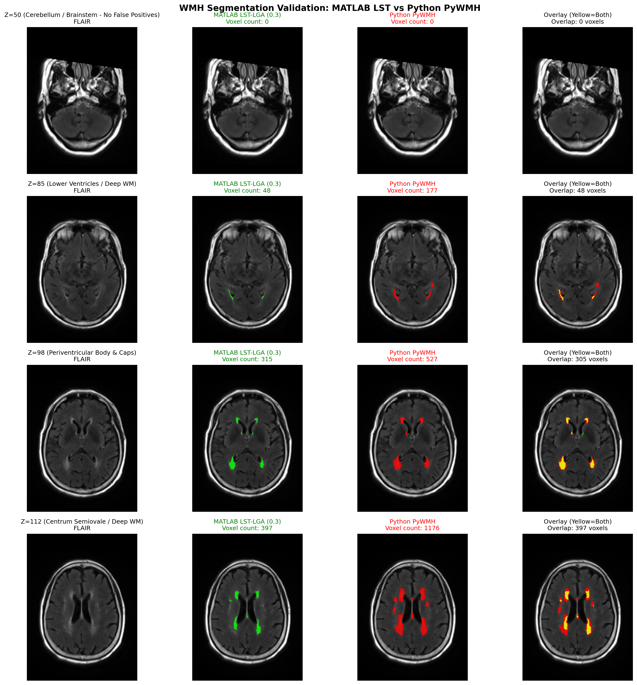
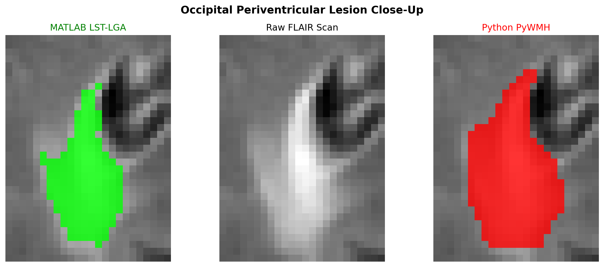

# WMH-Age-Prediction

Automated White Matter Hyperintensity (WMH) segmentation and WMH-based Brain Age Estimation pipeline for T1-weighted and 3D T2-FLAIR brain MRI scans.

This repository provides two pipelines:
1. **`pywmh_tool` (Recommended)**: A lightweight, standalone Python tool powered by FSL (for co-registration and tissue segmentation) and a faithful, pure-Python implementation of the **LST Lesion Growth Algorithm (LGA)** with MNI spatial priors (`atlas_wm` & `noles`). **Completely decoupled from MATLAB and SPM.**
2. **`AutomatedWMHAge.m` / `run_wmh_age.sh`**: The optimized legacy MATLAB pipeline using SPM12 and the LST toolbox, enhanced for headless command-line batch processing without GUI popups.

---

## Background & Methodology

The brain age prediction model is based on the publication:
> **Chu-Chung Huang, et al. (2022)**. *Brain white matter hyperintensities-predicted age reflects neurovascular health in middle-to-old aged subjects*. **Age and Ageing**, 51(8), afac106. [https://doi.org/10.1093/ageing/afac106](https://doi.org/10.1093/ageing/afac106)

The model computes volumes for:
- **PVWMH** (Periventricular White Matter Hyperintensity, ≤ 10 mm from ventricular lining)
- **DWMH** (Deep White Matter Hyperintensity, > 10 mm from ventricular lining)

The predicted WMH Brain Age is estimated via:

$$
\text{Predicted Age} = 11.069 \cdot \log_{10}(\max(V_{\text{PV}}, 10^{-4})) + 1.624 \cdot \log_{10}(\max(V_{\text{D}}, 10^{-4})) + 64.159
$$

---

## 1. Pure Python Standalone Pipeline (`pywmh_tool.py`)

### Algorithmic Framework: Faithful Python LST-LGA
`pywmh` is built directly upon the algorithmic principles of the **Lesion Growth Algorithm (LGA)** from the [LST toolbox](https://www.applied-statistics.de/lst.html) (Schmidt et al., 2012):
1. **Tissue Probability Mapping**: FSL FAST estimates Partial Volume Estimation (PVE) maps for CSF, Grey Matter, and White Matter.
2. **FLAIR Normalization**: Modal intensity normalization across brain tissue.
3. **Lesion Belief Calculation**: Initial lesion belief maps ($B_{\text{gm}}, B_{\text{wm}}, B_{\text{csf}}$) combine tissue probabilities, contrast differences, and spatial priors.
4. **Spatial Confinement Priors**: Integrates the official LST white matter tract prior (`atlas_wm.nii.gz`) and exclusion mask (`noles.nii.gz`) mapped to native space, strictly preventing false positives in the cerebellum, brainstem, and cerebral cortex.
5. **Iterative MRF Region Growing**: Uses a Markov Random Field (MRF) model with Gamma-distributed lesion likelihood and normal tissue Gaussian mixture models to iteratively grow lesions from seeds until convergence.
6. **Continuous Core Coverage**: Applies continuous numerical boundary logic to ensure severe, T1-hypointense lesion cores are solidly segmented without central cavities.

### The Role of $\kappa$ (Kappa)
**Does the algorithm require $\kappa$? Yes.**
As in the original LST-LGA implementation, $\kappa$ (kappa) is the user-definable **initial belief threshold** that governs seed initialization:
- **Default value**: `kappa = 0.3` (the recommended baseline by the LST developers for standard 3T FLAIR scans).
- **Lower $\kappa$ (e.g., `0.1` – `0.2`)**: More liberal; initializes more seeds, capturing subtle or faint punctate hyperintensities.
- **Higher $\kappa$ (e.g., `0.4` – `0.5`)**: More conservative; seeds are placed only on prominent, confluent hyperintensities.

### Requirements
- Python 3.8+
- [FSL](https://fsl.fmrib.ox.ac.uk/fsl/fslwiki) (FLIRT, BET, FAST, APPLYWARP)
- Python packages:
  ```bash
  pip install -r requirements.txt
  ```

### Usage
```bash
python pywmh_tool.py \
  --t1 /path/to/T1w.nii.gz \
  --flair /path/to/FLAIR.nii.gz \
  --age 65.0 \
  --outdir /path/to/output_directory \
  --kappa 0.3
```

#### Arguments:
- `--t1`: Path to T1-weighted structural MRI scan (`.nii` or `.nii.gz`).
- `--flair`: Path to 3D T2-FLAIR MRI scan (`.nii` or `.nii.gz`).
- `--age`: (Optional) Patient's actual chronological age in years. Automatically computes **Brain Age Gap (BAG)**.
- `--outdir`: Directory to save outputs.
- `--kappa`: Initial lesion belief threshold (default: `0.3`, standard LST-LGA setting).
- `--skip-qc`: (Optional) Skip generating visual QC HTML/PNG reports.
- `--force`: (Optional) Force re-running all steps even if intermediate files exist.
- `--nonlinear`: Use FSL FNIRT for non-linear registration to MNI (default: 12-DOF affine FLIRT for speed).
- `--fsl-dir`: Path to FSL directory if not set in `$FSLDIR`.

### Outputs
- `WMH_Age_QC_Report.html`: Self-contained, interactive HTML report with embedded high-resolution graphics, metrics tables, and registration sanity checks.
- `qc_summary.png`: Multi-slice thumbnail snapshot for rapid Finder / Explorer review.
- `WMH_Age_Results.csv`: Extended summary table with Total WMH, PVWMH, DWMH, TIV, % TIV, Predicted Age, Brain Age Gap, Lobar WMH (Frontal, Parietal, Temporal, Occipital, Subcortical), and Arterial Vascular WMH (ACA, MCA, PCA, VB).
- `WMH_Age_Results.json`: Comprehensive machine-readable quantification results.
- `bles_lga_k30.nii.gz`: Native-space binary WMH lesion mask.
- `ples_lga_k30.nii.gz`: Native-space lesion probability map.
- `native_PVWMH.nii.gz`: Native-space periventricular mask.
- `native_DWMH.nii.gz`: Native-space deep white matter mask.
- `native_lobar.nii.gz`: Native-space cerebral lobar parcellation.
- `native_arterial.nii.gz`: Native-space arterial vascular territory parcellation.
- `rmFLAIR.nii.gz`: Rigidly co-registered FLAIR aligned to T1.

---

## 2. Headless MATLAB Pipeline (`run_wmh_age.sh`)

If you require exact legacy SPM12/LST execution without launching the MATLAB GUI:

```bash
./run_wmh_age.sh \
  /Applications/MATLAB_R2022a.app/bin/matlab \
  /path/to/subjects_folder \
  /path/to/WMH_Atlas \
  /path/to/spm12
```

*(Note: The MATLAB version is also archived on the `matlab-version` branch of this repository).*

---

## Segmentation Validation & Visual Comparison

Visual comparison across axial slices between the legacy MATLAB LST-LGA pipeline (green) and the Python `pywmh_tool` implementation (red):



### Lesion Detail Close-Up
Close-up inspection of the periventricular occipital lesion confirms faithful boundary delineation and solid lesion core segmentation matching the FLAIR hyperintensity:



---

## Repository Structure
```
WMH-Age-Prediction/
├── pywmh/                  # Python core algorithmic library
│   ├── __init__.py
│   ├── lst_lga.py          # Faithful SPM LST-LGA implementation
│   ├── fsl_engine.py       # FSL wrapper (FLIRT, BET, FAST, APPLYWARP)
│   └── age_model.py        # WMH masking and age regression model
├── pywmh_tool.py           # CLI master entry point for Python pipeline
├── wmh_age_calc.py         # Standalone age calculator given existing masks
├── AutomatedWMHAge.m       # Optimized MATLAB pipeline (SPM12/LST)
├── run_wmh_age.sh          # Headless shell script for MATLAB execution
├── WMH_Atlas/              # 1mm and 1.5mm PV/D WMH atlases, atlas_wm & noles
├── requirements.txt        # Python package dependencies
├── LICENSE                 # MIT License
└── README.md               # Documentation
```

---

## Acknowledgements & Software Attributions

This project builds upon and integrates foundational tools developed by the neuroimaging community:

- **[LST (Lesion Segmentation Tool)](https://www.applied-statistics.de/lst.html)**: Developed by Paul Schmidt, Christian Gaser, and colleagues at the Technische Universität München. `pywmh` implements a faithful, MATLAB-independent Python port of the LST Lesion Growth Algorithm (LGA).
- **[FSL (FMRIB Software Library)](https://fsl.fmrib.ox.ac.uk/fsl/fslwiki)**: Developed by the Analysis Group, FMRIB, University of Oxford. Used in this pipeline for robust structural brain extraction (`bet`), rigid cross-modal co-registration (`flirt`), and automated tissue segmentation (`fast`).
- **[SPM (Statistical Parametric Mapping)](https://www.fil.ion.ucl.ac.uk/spm/)**: Developed by the Wellcome Centre for Human Neuroimaging, University College London (UCL). Hosts the reference MATLAB implementation of the LST toolbox.

---

## Citation

Please cite the corresponding papers depending on which components you use in your study:

### 1. For White Matter Hyperintensity (WMH) Lesion Segmentation (LST-LGA):
> **Schmidt P**, et al. *An automated tool for detection of FLAIR-hyperintense white-matter lesions in Multiple Sclerosis*. **NeuroImage**. 2012;59(4):3774-3788.  
> DOI: [10.1016/j.neuroimage.2011.11.032](https://doi.org/10.1016/j.neuroimage.2011.11.032)

```bibtex
@article{schmidt2012automated,
  title={An automated tool for detection of FLAIR-hyperintense white-matter lesions in Multiple Sclerosis},
  author={Schmidt, Paul and others},
  journal={NeuroImage},
  volume={59},
  number={4},
  pages={3774--3788},
  year={2012},
  publisher={Elsevier},
  doi={10.1016/j.neuroimage.2011.11.032}
}
```

### 2. For WMH-based Brain Age Prediction & Regional WMH Volume Calculation (PVWMH / DWMH):
> **Huang CC**, et al. *Brain white matter hyperintensities-predicted age reflects neurovascular health in middle-to-old aged subjects*. **Age and Ageing**. 2022;51(8):afac106.  
> DOI: [10.1093/ageing/afac106](https://doi.org/10.1093/ageing/afac106)

```bibtex
@article{huang2022brain,
  title={Brain white matter hyperintensities-predicted age reflects neurovascular health in middle-to-old aged subjects},
  author={Huang, Chu-Chung and others},
  journal={Age and Ageing},
  volume={51},
  number={8},
  pages={afac106},
  year={2022},
  publisher={Oxford University Press},
  doi={10.1093/ageing/afac106}
}
```

### 3. For FSL Processing Tools:
> **Jenkinson M**, Beckmann CF, Behrens TE, Woolrich MW, Smith SM. *FSL*. **NeuroImage**. 2012;62(2):782-790.  
> DOI: [10.1016/j.neuroimage.2011.09.015](https://doi.org/10.1016/j.neuroimage.2011.09.015)

```bibtex
@article{jenkinson2012fsl,
  title={FSL},
  author={Jenkinson, Mark and Beckmann, Christian F and Behrens, Timothy EJ and Woolrich, Mark W and Smith, Stephen M},
  journal={NeuroImage},
  volume={62},
  number={2},
  pages={782--790},
  year={2012},
  publisher={Elsevier},
  doi={10.1016/j.neuroimage.2011.09.015}
}
```

## License
MIT License
